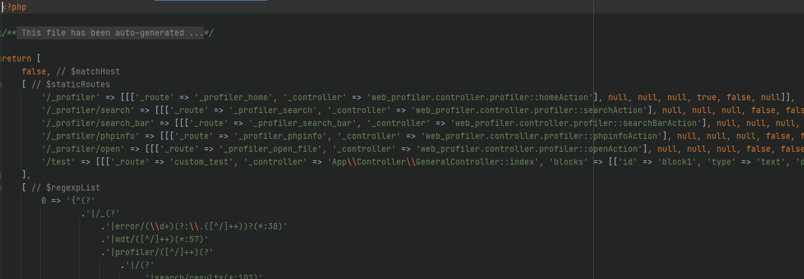

# block rendering project

This repository aim to propose how to render a list of pages with dynamic content.

The list of pages has to be inside an api with the block list definition as well.

## API

The api lool like this

## First load

## Generated cache

## Second load

